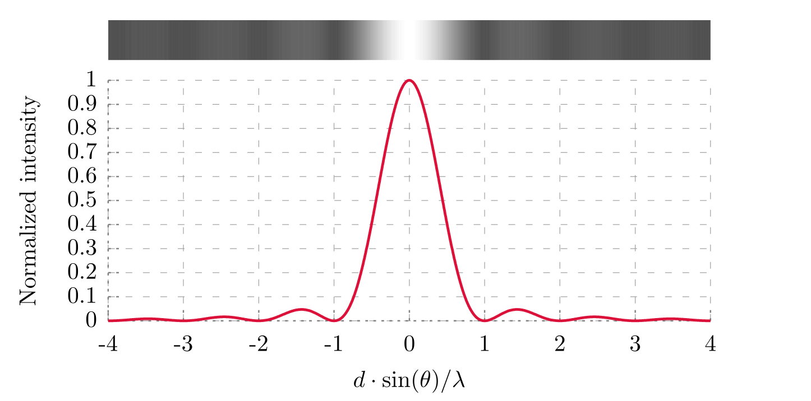
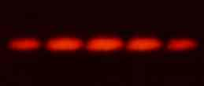
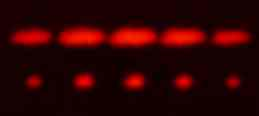

# Waves

**Waves** are periodic oscillations within a medium.

There are two directions of waves:

- **Longitudinal waves**: waves which involve the particles of the medium oscillating **parallel** to the direction of energy transfer.
- **Transverse waves**: waves which involve the particles of the medium oscillating **perpendicular** to the direction of energy transfer.

The main features of wave include:

- **Amplitude**: the distance between no displacement and maximum displacement of a particle during an oscillation.
- **Wavelength**: the distance between two consecutive crests or the distance between two consecutive troughs.
- **Period**: the amount of time it takes for a whole cycle of a wave to pass through a point.

Some properties of waves include:

- **Cycle**: the completion of one sequence of an oscillatory pattern. In waves, this is referring to the process which completes one iteration of its oscillation.
- **Frequency**: the amount of times which a particle completes a cycle per unit time.

## Frequency and Period

The relationship between the frequency and the period is:

$$ f=\frac{1}{T} $$

## Phase difference

The **phase difference** is the difference in alignment between two waves which have the same wavelength and frequency.

For example, if one wave is $\pi$ radians ahead of another wave, and both waves have a wavelength more than $\pi$, then the phase difference between the two waves is $\pi$.

## Path difference

The **path difference** is the difference in the distance travelled by two waves when they meet.

## Coherence

When two waves are **coherent**, it means that the two waves have the same wavelength and the same phase difference.

## Interference

Waves can exhibit **interference**, which is the interaction between two waves which causes the resulting amplitude of the two waves to change temporarily.

Given two coherent waves, they may **constructively interfere** or **destructively interfere**, depending on their path differences.

If the path difference between two coherent waves is $0$, then the waves will constructively interfere.

## Light slit experiments

A **light slit experiment** involves a single light source shined at some number of slits. The light travels through, exhibiting a combination of diffraction and interference, eventually showing a pattern on a screen.

### Single-Slit

Light passing through a single slit will exhibit only diffraction but not interference. The diffraction will happen along the edges of the slit and there will be no wave sources to interfere with.

[Diffraction pattern of a single slit](<https://commons.wikimedia.org/wiki/File:Single_Slit_Diffraction_(english).svg>) by [DL6ER](https://commons.wikimedia.org/w/index.php?title=User:DL6ER&action=edit&redlink=1) is licensed under [CC BY-SA 4.0](http://creativecommons.org/licenses/by-sa/4.0)
Some aspects of a single-slit experiment can be described with the following equation:

$$ \theta=\frac{\lambda}{b} $$

where:

- $\theta$: the angle between the central maximum and the first dark fringe
- $\lambda$: the wavelength
- $b$: the width of the slit

### Double-Slit

Thomas Young conducted the **double-slit experiment**.

The double-slit experiment was famous because it demonstrated for the first time that light could exhibit properties of waves. Most notably, Young was able to demonstrate that light could interfere with each other.

[2-slit diffraction of red laser light](https://commons.wikimedia.org/wiki/File:Laserdiffraction.jpg) by [Benjamin Crowell](https://en.wikipedia.org/wiki/User:Bcrowell), Modifications: is licensed under [CC BY-SA 3.0](http://creativecommons.org/licenses/by-sa/3.0)

$$ s=\frac{\lambda D}{d} $$

where:

- $s$: the distance between two fringes
- $\lambda$: the wavelength
- $D$: the distance between the slits and the screen
- $d$: the distance between the two slits

### Diffraction Grating

A **diffraction grating** contains many slits.

Note that, in a diffraction grating, the slits are evenly-spaced apart.

$$ n\lambda=d\sin(\theta) $$

where:

- $n$: the $n$-th maxima (bright fringe)
- $\lambda$: the wavelength
- $d$: the distance between the slits
- $\theta$: the angle between the $n$-th maxima and the central maximum

["This work"](https://commons.wikimedia.org/wiki/File:Diffraction2vs5.jpg) is licensed under [CC BY-SA 3.0](http://creativecommons.org/licenses/by-sa/3.0)

## Refraction

When a light hits a medium, its trajectory may change. In other words, say a light travels from air into water, the light will not continue travelling in a straight line but bend. This process of bending is called **refraction**.

This can be easily observed in everyday life. An object deep underneath water is not where it appears to be to someone looking down at it. This is due to refraction.

Aspects of refraction is dependent on the **refractive index** of a material, which is the ratio between the apparent speed of light in vacuum to the apparent speed of light in that specific material. _i.e._:

$$ n=\frac{c}{v} $$

### Snell's Law

The aspects of refractions are related using **Snell's law**:

$$ \frac{n_1}{n_2}=\frac{\sin(\theta_2)}{\sin(\theta_1)} $$

where:

- $n_1$: the refractive index of the material 1
- $n_2$: the refractive index of the material 2
- $\theta_1$: the angle which the light travels in material 1 relative to the normal
- $\theta_2$: the angle which the light travels in material 2 relative to the normal

By extension, since the refractive index of a material is related to the apparent speed of light in that material, we can derive that:

$$ \frac{n_1}{n_2}=\frac{\frac{c}{v_1}}{\frac{c}{v_2}}=\frac{v_2}{v_1} $$

Similarly, because the apparent velocity is related to wavelength (and that the frequency of a light wave does not change), we can derive that:

$$ \frac{v_2}{v_1}=\frac{\lambda_2 f}{\lambda_1 f}=\frac{lambda_2}{lambda_1} $$

Thus:

$$ \frac{n_1}{n_2}=\frac{\sin(\theta_2)}{\sin(\theta_1)}=\frac{\frac{c}{v_1}}{\frac{c}{v_2}}=\frac{v_2}{v_1}=\frac{lambda_2}{lambda_1} $$

## Critical Angle

The **critical angle** refers to:

- the smallest angle from the normal such that an incident light ray can take while exhibiting total internal reflection
- the largest angle from the normal such that (a part of) an incident light ray can be refracted.

## Standing Waves

A **standing wave** is a wave that appears to be stationary in position but oscillate in time.

A standing wave has no net transfer of energy.

**Nodes** are points that do not oscillate in space (and appear to be stationary).

**Antinodes** are points of a wave that oscillate with the amplitude (have the maximum magnitude oscillation).

Given a standing wave, any adjacent pair of nodes or antinodes are **in antiphase** with each other, meaning that the phase difference between them is $\pi$ radians. A pair of nodes or antinodes that are separated by one node or an antinode (respectively) are **in phase** with each other, meaning that the phase difference between them is $0$.

### Standing Waves in Pipes

A pipe can either have two open ends, two closed ends, or one open end and one closed end.

An example of a pipe that has two open ends is the flute.

Two closed ends or two open ends:

$$ \lambda_n=\frac{2L}{n} $$

$n$ can be any natural number.

Note that the above equation can be used for waves on a string that has either fixed or open boundaries too.

One open end and one closed end:

$$ \lambda_n=\frac{4L}{n} $$

$$n$$ can only be an odd, natural number.

## Miscellaneous

A light wave undergoes $pi$ radians phase change when reflected from a material with a higher refractive index.

A wave on a string undergoes $pi$ radians phase change and inverts (vertically) when reflected across a boundary.
